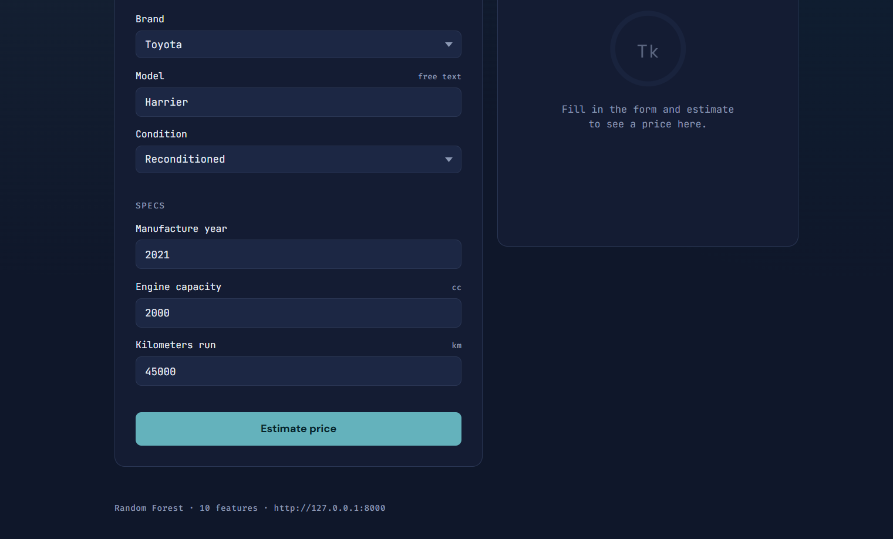
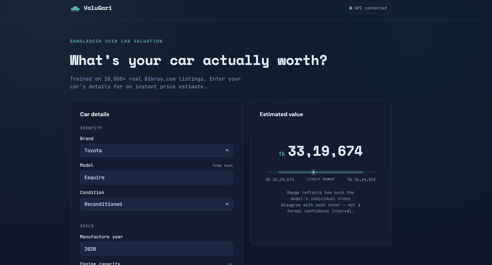

# ValuGari — Bangladesh Car Price Estimator

FastAPI service around a Random Forest model trained on 10,000+ real
Bikroy.com used-car listings. Takes a car's brand, model, condition, and
specs, and returns an estimated price in Tk with a likely range.

```
car-price-api/
├── app/
│   ├── main.py            # FastAPI app, CORS, lifespan model loading, serves frontend/
│   ├── config.py           # Settings (env-driven)
│   ├── schemas.py           # Request/response validation
│   ├── model.py            # Loads the .pkl, raw-input -> feature-row -> prediction + range
│   └── routers/predict.py   # POST /predict, GET /health
├── frontend/                # Static UI (vanilla HTML/CSS/JS), served at "/"
│   ├── index.html
│   ├── style.css
│   └── script.js
├── models/car_price_model.pkl # Exported from the notebook (section 6)
├── tests/test_predict.py
├── screenshot/               # ss1.png / ss2.png go here — see Screenshots below
├── requirements.txt
├── Dockerfile
└── .env.example
```

The training notebook (`car_price_prediction.ipynb`) is delivered separately,
not inside this folder — it's what produced `models/car_price_model.pkl`.

## Screenshots


| Main page | Prediction result |
|---|---|
|  |  |

## 1. Setup (Windows / PowerShell)

```powershell
# from the car-price-api folder
python -m venv venv
.\venv\Scripts\Activate.ps1
pip install -r requirements.txt
```

If activation fails with *"running scripts is disabled on this system"*:
```powershell
Set-ExecutionPolicy -ExecutionPolicy RemoteSigned -Scope CurrentUser
```

**macOS/Linux**:
```bash
python -m venv venv && source venv/bin/activate && pip install -r requirements.txt
```

`models/car_price_model.pkl` is already included — nothing extra to place there.

## 2. Run it

```powershell
uvicorn app.main:app --reload
```

Open **http://127.0.0.1:8000/** for the actual site, or
**http://127.0.0.1:8000/docs** for interactive API docs (Swagger UI).

The frontend calls the API via the `API_BASE_URL` constant at the top of
`frontend/script.js` (defaults to `http://127.0.0.1:8000`) — change that one
line if you ever host the API elsewhere.

## 3. Try it

PowerShell:
```powershell
Invoke-RestMethod -Uri http://127.0.0.1:8000/api/v1/predict -Method Post `
  -ContentType "application/json" `
  -Body '{"brand":"Toyota","model":"Harrier","engine_capacity":2000,"km_run":45000,"man_year":2021,"condition":"Reconditioned"}'
```

curl:
```bash
curl -X POST http://127.0.0.1:8000/api/v1/predict \
  -H "Content-Type: application/json" \
  -d '{"brand":"Toyota","model":"Harrier","engine_capacity":2000,"km_run":45000,"man_year":2021,"condition":"Reconditioned"}'
```

Response:
```json
{"predicted_price": 8143794.0, "price_range_low": 7800000.0, "price_range_high": 8535000.0}
```

## 4. Run the tests

```powershell
pytest tests/ -v
```

6 tests: health check, a valid prediction, an unrecognized-model input
(confirms the API still returns a sane result instead of erroring), and
three 422-validation cases.

## 5. Docker (optional)

```bash
docker build -t car-price-api .
docker run -p 8000:8000 car-price-api
```

## API reference

### `POST /api/v1/predict`
| field | type | notes |
|---|---|---|
| `brand` | string | Any value works; only `"Toyota"` (vs. anything else) actually changes the prediction — see Notes |
| `model` | string | Free text, e.g. `"Harrier"`. Recognized nameplates (case-insensitive): Vogue, Harrier, RX, CR-V. Anything else is treated as "other" |
| `engine_capacity` | float | 600–6000 cc |
| `km_run` | float | 0–500,000 km |
| `man_year` | int | 1990–2026 |
| `condition` | string | `New`, `Used`, or `Reconditioned` |

Returns `{ "predicted_price": float, "price_range_low": float, "price_range_high": float }`,
all in Tk. Invalid values → `422` before the model ever runs.

### `GET /api/v1/health`
Returns `{ "status": "ok" | "degraded", "model_loaded": bool }`.

## Notes / known limitations

- **Why brand/model barely matter beyond a few names**: the notebook selects
  the 10 *most* important features across the whole encoded dataset (365
  columns after one-hot encoding). Engine size, mileage, and manufacture year
  dominate; past those three, only `condition`, `brand_Toyota`, and four
  specific model nameplates (Vogue, Harrier, RX, CR-V) made the cut. The API
  still accepts any brand/model text — it just won't distinguish, say, Honda
  from BMW, because the training data (88% Toyota listings) never gave the
  model a reason to weight that split highly. See the notebook's section 3
  for the actual importance ranking.
- **The price range is real, not decorative**: it's the 10th–90th percentile
  spread across the 200 individual trees' predictions for that input, not an
  invented ±X%. Wide range = the trees disagree = treat the point estimate
  with more caution.
- **Model size**: capped at `max_depth=15`, `min_samples_leaf=3` — left
  unbounded, the same forest serializes to 160MB+ for a ~0.002 R² gain (see
  the notebook, section 4). Capped version is 16MB.
- **scikit-learn version pinning matters**: the pkl was built with
  scikit-learn 1.8.0 (pinned in `requirements.txt`). A different major/minor
  version loading the same pickle can warn or break outright.
- **Data quality**: this is a raw marketplace scrape, not a curated dataset —
  38 rows with implausible prices and 14 with implausible mileage were
  dropped during preprocessing (see notebook section 2). Model quality:
  R²≈0.77, MAPE≈16.5% on held-out data.
